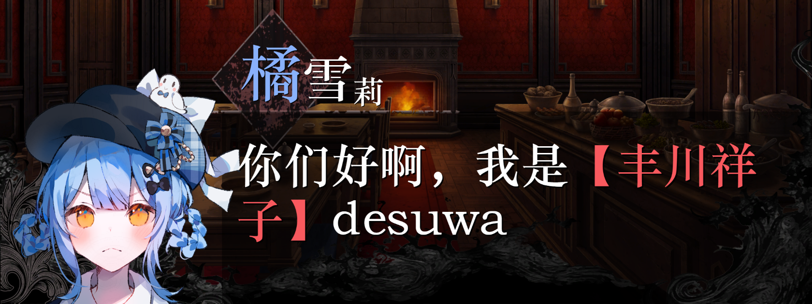

# Sherri Message

LiteLoaderQQNT 插件 - 将文字消息转换为「魔女审判」风格图片发送

## 功能

- 一键将输入框文字转换为橘雪莉风格图片
- 随机选择背景和角色立绘
- 支持 `[中括号]` 或 `【中括号】` 内文字红色高亮
- 自动发送生成的图片
- 可自定义文字位置、角色偏移、字号范围等参数
- 支持快捷键发送 (默认 Shift+Enter)

## 版本说明

### v2.0 - QQ 9.9.18+ 适配

本版本针对 QQ NT 9.9.18+ 进行了完全重写，不再依赖 Euphony 库。

**技术亮点：剪贴板保护机制**

由于 QQ 新版本限制了直接调用消息发送 API，我们采用了创新的"粘贴发送"方案：

1. **保存剪贴板** - 发送前自动备份当前剪贴板内容（支持文本、HTML、图片）
2. **生成图片** - 使用 Canvas 渲染魔女审判风格图片
3. **粘贴到编辑器** - 通过 Clipboard API 写入图片并触发粘贴
4. **自动发送** - 点击发送按钮完成发送
5. **恢复剪贴板** - 发送后自动还原原有剪贴板内容

这样既能绕过 API 限制，又不会污染用户的剪贴板内容。

## 安装

1. 下载本仓库
2. 将整个文件夹复制到 LiteLoaderQQNT 的 `plugins` 目录
3. 重启 QQ

## 使用

1. 在聊天窗口输入文字
2. 点击发送按钮旁边的 `Sherri !` 按钮，或使用快捷键 (默认 Shift+Enter)
3. 插件会自动生成图片并发送

## 设置

在 LiteLoaderQQNT 设置页面中可以调整：

- 快捷键设置 (Shift/Ctrl/Alt + 按键)
- 角色名称位置偏移 (X/Y)
- 文本区域边距 (左/右/上/下)
- 字体大小范围 (最大/最小)
- 预览测试功能

## 截图

## 调试

插件启动后会显示一个调试面板，可以查看：
- Peer 信息（聊天窗口状态）
- API 可用性检查
- 详细的发送日志

## 致谢

- 角色素材来自游戏「魔女审判」
- 基于 [LiteLoaderQQNT-PluginTemplate-Vite](https://github.com/MisaLiu/LiteLoaderQQNT-PluginTemplate-Vite) 模板

## License

GPL-3.0
